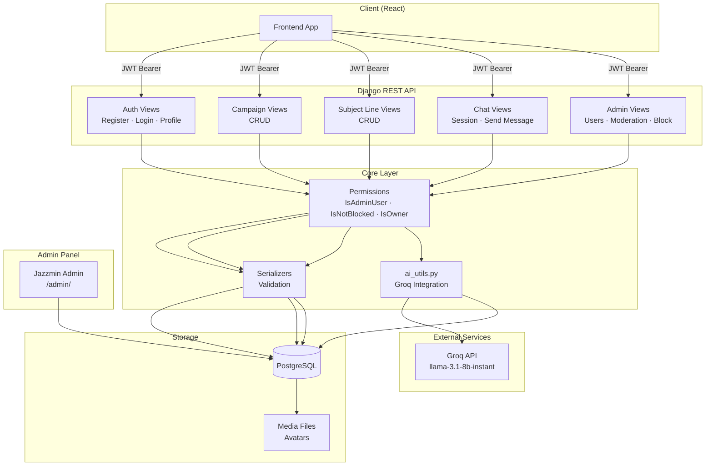
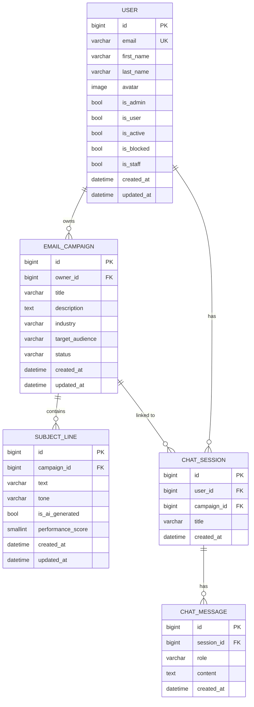
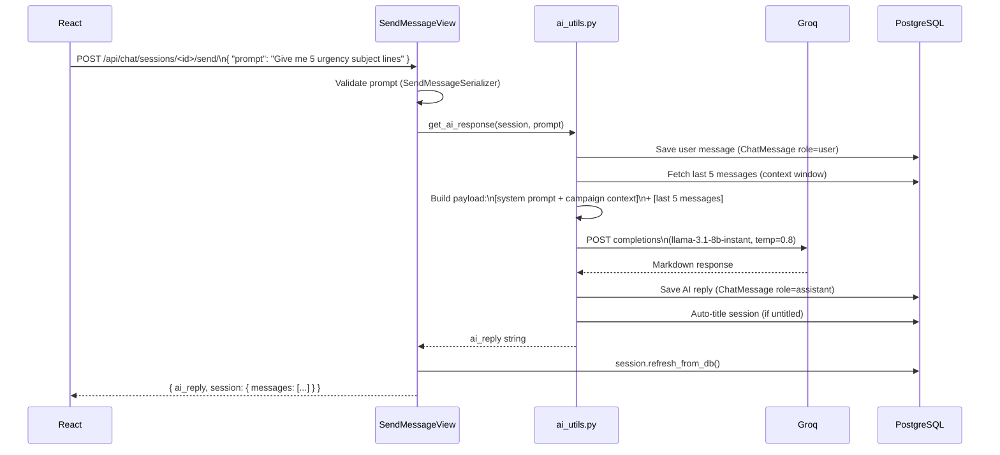
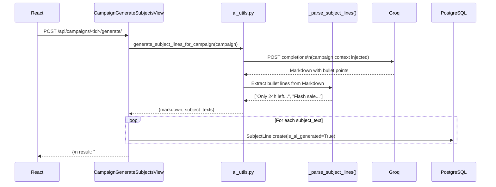
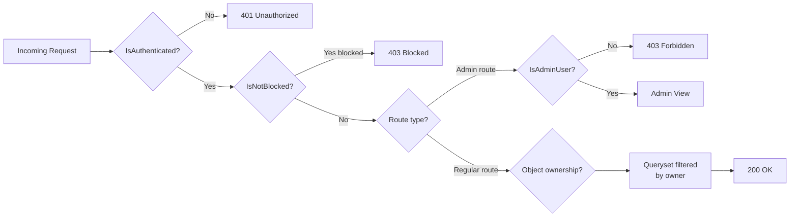

# ✉ Email Subject Line Optimizer — Backend

> **AI-powered Django REST API** that helps marketers generate, manage, and A/B test email subject lines using Groq's LLaMA model.


---

## Table of Contents

- [Overview](#overview)
- [Tech Stack](#tech-stack)
- [Architecture](#architecture)
- [Database Schema](#database-schema)
- [AI Flow](#ai-flow)
- [Project Structure](#project-structure)
- [Quick Start](#quick-start)
- [Environment Variables](#environment-variables)
- [API Reference](#api-reference)
- [Permissions & Security](#permissions--security)
- [Throttling & Pagination](#throttling--pagination)
- [Admin Panel](#admin-panel)
- [Key Design Decisions](#key-design-decisions)

---

## Overview

Users create **Email Campaigns** (e.g. "Black Friday Sale"), then use the **AI Chat** to brainstorm subject lines with a context-aware copywriting assistant. Subject lines can also be bulk-generated from a campaign in one click. All AI output is stored in the DB and linked back to the campaign.

```
User → Create Campaign → Chat with AI / One-shot Generate
                      ↓
              Subject Lines saved to DB
                      ↓
         Score them (A/B testing) → Pick winner
```

---

## Tech Stack

| Layer | Technology |
|---|---|
| Language | Python 3.12 |
| Framework | Django 4.2.11 |
| REST API | Django REST Framework 3.15.1 |
| Auth | JWT via `djangorestframework-simplejwt` |
| AI | Groq API — `llama-3.1-8b-instant` |
| Database | PostgreSQL 15 (Docker) |
| Admin UI | django-jazzmin |
| API Docs | drf-spectacular (Swagger + ReDoc) |
| CORS | django-cors-headers |
| Config | python-decouple |

---

## Architecture



---

## Database Schema



### Field Choices

| Model | Field | Options |
|---|---|---|
| `EmailCampaign` | `industry` | `ecommerce` · `saas` · `finance` · `healthcare` · `education` · `other` |
| `EmailCampaign` | `status` | `draft` · `active` · `archived` |
| `SubjectLine` | `tone` | `professional` · `casual` · `urgent` · `curious` · `funny` |
| `ChatMessage` | `role` | `user` · `assistant` |

---

## AI Flow

### Chat Session (multi-turn)



### One-Shot Campaign Generation



### Context Window Logic

```
DB Messages (ordered by created_at):
  msg_1  msg_2  msg_3  msg_4  msg_5  msg_6  msg_7  [new_prompt]
                               └──────────────────────────────┘
                                  Last 5 sent to Groq
```

---

## Project Structure

```
backend/
│
├── config/                     # Django project package
│   ├── __init__.py
│   ├── settings.py             # All settings (JWT, CORS, Jazzmin, DB, logging)
│   ├── urls.py                 # Root URL conf + Swagger routes
│   └── wsgi.py
│
├── core/                       # Single Django app
│   ├── models.py               # User, EmailCampaign, SubjectLine, ChatSession, ChatMessage
│   ├── serializers.py          # 13 serializers with full validation
│   ├── views.py                # 18 API views (DRF Generics + APIView)
│   ├── urls.py                 # 22 URL patterns
│   ├── admin.py                # Jazzmin admin with custom actions & badges
│   ├── ai_utils.py             # Groq integration, context window, subject parser
│   ├── permissions.py          # IsAdminUser, IsNotBlocked, IsOwner, IsOwnerOrReadOnly
│   └── migrations/
│       ├── 0001_initial.py
│       └── 0002_subjectline_updated_at_...py
│
├── .env                        # Local env (never commit)
├── .env.example                # Safe reference template
├── docker-compose.yml          # PostgreSQL container
├── manage.py
├── requirements.txt
└── README.md
```

---

## Quick Start

### Prerequisites
- Python 3.12+
- Docker Desktop
- A [Groq API key](https://console.groq.com) (free tier available)

### 1 — Clone & set up environment

```bash
cd backend
python -m venv venv

# Windows
source venv/Scripts/activate

# macOS / Linux
source venv/bin/activate

pip install -r requirements.txt
```

### 2 — Configure environment

```bash
cp .env.example .env
```

Edit `.env` and fill in your values:

```env
SECRET_KEY=your-secret-key-here          # generate with: python -c "from django.core.management.utils import get_random_secret_key; print(get_random_secret_key())"
GROQ_API_KEY=gsk_...                     # from https://console.groq.com
DB_PASSWORD=postgres
```

### 3 — Start the database

```bash
docker-compose up -d
```

This starts a PostgreSQL 15 container on port `5432` (or the port in your `.env`).

### 4 — Run migrations

```bash
python manage.py migrate
```

### 5 — Create a superuser (admin panel access)

```bash
python manage.py createsuperuser
# Enter email + password when prompted
```

### 6 — Start the dev server

```bash
python manage.py runserver
```

| URL | Description |
|---|---|
| `http://localhost:8000/api/schema/swagger-ui/` | Swagger UI — test all endpoints |
| `http://localhost:8000/api/schema/redoc/` | ReDoc documentation |
| `http://localhost:8000/admin/` | Jazzmin admin panel |

---

## Environment Variables

| Variable | Required | Default | Description |
|---|---|---|---|
| `SECRET_KEY` | ✅ | — | Django secret key |
| `DEBUG` | ✅ | `False` | Enable debug mode |
| `ALLOWED_HOSTS` | ✅ | `localhost` | Comma-separated allowed hosts |
| `DB_NAME` | ✅ | — | PostgreSQL database name |
| `DB_USER` | ✅ | — | PostgreSQL user |
| `DB_PASSWORD` | ✅ | — | PostgreSQL password |
| `DB_HOST` | ✅ | `localhost` | PostgreSQL host |
| `DB_PORT` | ✅ | `5432` | PostgreSQL port |
| `GROQ_API_KEY` | ✅ | — | Groq API key from console.groq.com |
| `CORS_ALLOWED_ORIGINS` | ✅ | `http://localhost:3000` | Comma-separated React origins |

---

## API Reference

### Authentication

All protected endpoints require:
```
Authorization: Bearer <access_token>
```

#### Register
```http
POST /api/auth/register/
Content-Type: application/json

{
  "email": "user@example.com",
  "first_name": "Jane",
  "last_name": "Doe",
  "password": "SecurePass123!",
  "confirm_password": "SecurePass123!"
}
```

#### Login
```http
POST /api/auth/login/
Content-Type: application/json

{
  "email": "user@example.com",
  "password": "SecurePass123!"
}

→ { "access": "eyJ...", "refresh": "eyJ..." }
```

#### Refresh Token
```http
POST /api/auth/token/refresh/
{ "refresh": "eyJ..." }
→ { "access": "eyJ..." }
```

#### Profile
```http
GET   /api/auth/profile/
PATCH /api/auth/profile/
{ "first_name": "Jane", "last_name": "Smith" }
```

#### Change Password
```http
POST /api/auth/change-password/
{ "old_password": "...", "new_password": "...", "confirm_password": "..." }
```

---

### Campaigns

#### List / Create
```http
GET  /api/campaigns/           → paginated list (20/page)
POST /api/campaigns/
{
  "title": "Black Friday 2024",
  "description": "40% off everything storewide",
  "industry": "ecommerce",
  "target_audience": "Women 25-40 interested in fashion",
  "status": "draft"
}
```

#### Detail / Update / Delete
```http
GET    /api/campaigns/<id>/
PATCH  /api/campaigns/<id>/   { "status": "active" }
DELETE /api/campaigns/<id>/
```

#### AI — Generate Subject Lines ⚡
```http
POST /api/campaigns/<id>/generate/

→ {
    "result": "### Urgency-Based\n- Only 24h left...\n...",
    "saved": [ { "id": 1, "text": "Only 24h left", "is_ai_generated": true, ... } ],
    "saved_count": 9
  }
```
> Subject lines are **automatically saved** to the campaign. No manual copying needed.

---

### Subject Lines

```http
GET  /api/campaigns/<id>/subjects/    → paginated list
POST /api/campaigns/<id>/subjects/
{
  "text": "Flash sale: 48 hours only",
  "tone": "urgent",
  "performance_score": 72
}

GET    /api/subjects/<id>/
PATCH  /api/subjects/<id>/   { "performance_score": 85 }
DELETE /api/subjects/<id>/
```

---

### AI Chat

#### Start a session
```http
POST /api/chat/sessions/
{
  "title": "Black Friday brainstorm",   ← optional, auto-generated from first prompt
  "campaign": 3                          ← optional, links campaign context
}
```

#### Send a message
```http
POST /api/chat/sessions/<id>/send/
{ "prompt": "Give me 5 curiosity-based subject lines for my fashion campaign" }

→ {
    "ai_reply": "### Curiosity-Based\n- What's inside this box?...",
    "session": {
      "id": 1,
      "title": "Give me 5 curiosity-based...",
      "messages": [
        { "role": "user",      "content": "Give me 5 curiosity...", ... },
        { "role": "assistant", "content": "### Curiosity-Based\n...", ... }
      ]
    }
  }
```

#### List / Delete sessions
```http
GET    /api/chat/sessions/         → paginated
GET    /api/chat/sessions/<id>/    → full session with all messages
DELETE /api/chat/sessions/<id>/    → deletes session + all messages
```

---

### Admin Endpoints _(is_admin=True required)_

```http
# Users
GET  /api/admin/users/                  ?search=email  ?is_blocked=true
GET  /api/admin/users/<id>/
POST /api/admin/users/<id>/block/       { "block": true }

# Campaigns (all users)
GET    /api/admin/campaigns/            ?status=active  ?owner=email
PATCH  /api/admin/campaigns/<id>/
DELETE /api/admin/campaigns/<id>/

# Subject Lines (moderation)
GET    /api/admin/subjects/             ?is_ai_generated=true
PATCH  /api/admin/subjects/<id>/
DELETE /api/admin/subjects/<id>/
```

---

## Permissions & Security



| Permission Class | Check | Applied To |
|---|---|---|
| `IsAuthenticated` | Valid JWT token | Every protected route |
| `IsNotBlocked` | `user.is_blocked == False` | All regular user routes |
| `IsAdminUser` | `user.is_admin == True` | All `/api/admin/*` routes |
| `IsOwner` | `obj.owner == request.user` | Object-level checks |
| `IsOwnerOrReadOnly` | Owner for writes, public for reads | Future public endpoints |

### What a blocked user gets
```json
HTTP 403
{ "detail": "Your account has been blocked. Please contact support." }
```

---

## Throttling & Pagination

### Rate Limits

| Scope | Limit | Applied To |
|---|---|---|
| `anon` | 30 / hour | Unauthenticated (register) |
| `user` | 300 / hour | All authenticated requests |
| `ai` | 30 / hour | `/send/` and `/generate/` only |

### Pagination

All list endpoints return:
```json
{
  "count": 45,
  "next": "http://localhost:8000/api/campaigns/?page=2",
  "previous": null,
  "results": [ ... ]
}
```

Default page size: **20 items**. Override with `?page=2`.

---

## Admin Panel

Access at `http://localhost:8000/admin/` after creating a superuser.

### Features

| Section | Capabilities |
|---|---|
| **Users** | View all users, role/status badges, bulk block/unblock |
| **Campaigns** | Full CRUD, inline subject lines, bulk archive |
| **Subject Lines** | Moderation view, filter by AI/manual, bulk tag |
| **Chat Sessions** | Browse all sessions, read-only message history inline |
| **Chat Messages** | Fully read-only (no add/edit — audit integrity) |

### Admin Actions

| Action | Effect |
|---|---|
| Block selected users | Sets `is_blocked=True`, `is_active=False` (skips admins) |
| Unblock selected users | Restores access |
| Archive selected campaigns | Sets `status=archived` |
| Mark as AI-generated | Tags subject lines with `is_ai_generated=True` |

---

## Key Design Decisions

### Why a single `core` app?
For an MVP, one app keeps everything easy to find. Scale into multiple apps (`accounts`, `campaigns`, `chat`) only when the codebase grows past ~2000 lines per file.

### Why `is_blocked` instead of deleting users?
Soft blocking preserves audit trails. A deleted user would orphan their campaigns and chat history. Blocking just revokes access.

### Why save AI subject lines to DB automatically?
The previous design returned raw Markdown which users had to manually copy. Now `POST /campaigns/<id>/generate/` saves every parsed bullet point as a `SubjectLine` record instantly — zero friction.

### Context window strategy
```python
# Newest-first slice, then reverse → cleanest Django ORM approach
session.messages.order_by("-created_at")[:5]  →  reversed()
```
Avoids complex SQL subqueries while fetching exactly the right messages.

### Why `textwrap.shorten()` for session titles?
```python
# Before (broken):  "Give me 5 curiosity-based subject li"   ← cut mid-word
# After  (fixed):   "Give me 5 curiosity-based subject…"     ← clean ellipsis
textwrap.shorten(prompt, width=60, placeholder="…")
```

### JWT token strategy

| Token | Lifetime | Rotation |
|---|---|---|
| Access | 1 hour | No (stateless) |
| Refresh | 7 days | Yes — new refresh issued on every use |

### `transaction.atomic()` on AI saves
The user message is saved first (so it appears in context), then the Groq call is made, then the AI reply is saved atomically. If the save fails, the DB stays consistent.

---

## Production Checklist

- [ ] Generate a new `SECRET_KEY`
- [ ] Set `DEBUG=False`
- [ ] Set `ALLOWED_HOSTS` to your actual domain
- [ ] Uncomment security headers in `settings.py` (HTTPS, HSTS, secure cookies)
- [ ] Configure a file storage backend for `MEDIA_ROOT` (e.g. AWS S3)
- [ ] Add a proper logging backend (e.g. Sentry)
- [ ] Set `POSTGRES_PASSWORD` to a strong password
- [ ] Use `gunicorn` + `nginx` instead of `manage.py runserver`
- [ ] Set `CORS_ALLOWED_ORIGINS` to your production frontend URL only

---

## License

MIT — free to use and modify.
